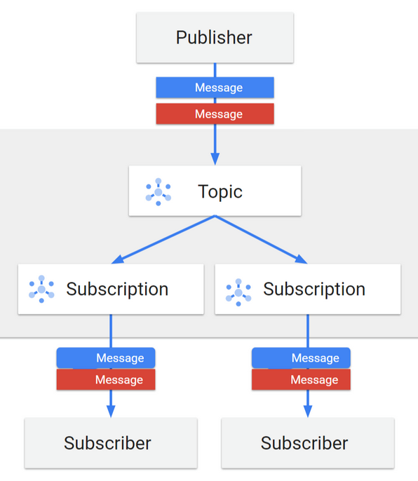

# PubSub Go

This project is an in-memory Pub/Sub (Publish/Subscribe) message broker implemented in Go (Golang). The broker supports a fan-out model for topic-based message delivery, ensuring that messages published to a topic are delivered to all subscribers of that topic. Communication with the message broker is facilitated through a REST API, making it accessible and easy to integrate with other services.



## Getting Started
### Prerequisites
Go version 1.23.1 or higher.

### Usage
1. Clone the repository: ```git clone https://github.com/rsc1102/PubSub-Go.git```
2. Install dependencies: ```go mod tidy```
3. Run the application: ```go run main.go```

## API Endpoints
The message broker provides the following REST API endpoints:

1. `GET /ping` : Returns `PONG` if server is active.
2. `POST /topics`: Creates a topic. 
   - JSON schema: ``` { "topic" : "topic1"}```
3. `DELETE /topics`: Deletes a topic
   - JSON schema: ``` { "topic" : "topic1"}```
4. `GET /topics`: Returns all topics 
5. `POST /subscriptions`: Creates a subscription for a topic. 
   - JSON schema: ``` { "topic": "topic1", "subscription": "alpha" }```
6. `DELETE /subscriptions`: Deletes a subscription for a topic.
   - JSON schema: ``` { "topic": "topic1", "subscription": "alpha" }```
7. `GET /subscriptions`: Returns all subscriptions for a topic if it is provided, else returns all subscriptions for all topics. 
8. `POST /publish`: Publishes message to a topic.
   - JSON schema: ```{ "topic": "topic1", "content": "msg" }```
9. `POST /consume`: Consumes a message from a subscription.
    - JSON schema: ```{ "topic": "topic1", "subscription": "alpha" }```
   
## Project Structure

```
.
├── go.mod                 # Module definition file
├── go.sum                 # Dependency checksum file
├── main.go                # Entry point of the application
├── api/handlers/          # Contains API handler
│   └── handler.go         # API handler
└── internal/services/     # Contains internal service logic
    └── service.go         # Service implementation
```


