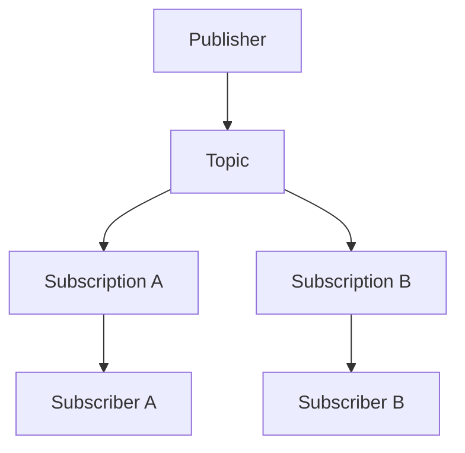

# PubSub Go

This project is an in-memory Pub/Sub message broker written in Go. It uses a fan-out model for topic-based delivery and exposes an HTTP API for integration. Each subscription has a buffered delivery channel, and subscribers receive messages over a long-lived Server-Sent Events (SSE) stream. Publishing is fire-and-forget across subscriptions for a topic: subscribers with available buffer space receive the message, while full subscriber buffers silently drop that publish attempt.

Each subscription defaults to a buffer capacity of `10` messages. When running the HTTP server, override it with `-queue-size`, for example `go run main.go -queue-size 100`. If you embed the service directly, pass a custom capacity to `services.NewPubSub(...)`.


```mermaid
flowchart TD
    Publisher --> Topic
    Topic --> SubscriptionA[Subscription A]
    Topic --> SubscriptionB[Subscription B]
    SubscriptionA --> SubscriberA[Subscriber A]
    SubscriptionB --> SubscriberB[Subscriber B]
```

## Getting Started
### Prerequisites
Go version 1.23.1 or higher.

### Usage
1. Clone the repository: ```git clone https://github.com/rsc1102/PubSub-Go.git```
2. Install dependencies: ```go mod tidy```
3. Run the application: ```go run main.go```
   - Optional: set a custom per-subscription queue capacity with `-queue-size`, for example ```go run main.go -queue-size 100```

### Benchmarks
Run the service-layer benchmarks with:

```bash
go test ./internal/services -run '^$' -bench .
```

The benchmark suite covers:
- `BenchmarkPublish`: publish cost as subscriber fan-out grows.
- `BenchmarkConsume`: steady-state cost of draining a subscription buffer directly from the service layer.
- `BenchmarkPublishParallel`: concurrent publish throughput against the shared broker state.
- `BenchmarkPublishConsumeParallel`: concurrent publish and consume throughput across sharded topics.

Run the HTTP handler benchmarks with:

```bash
go test ./api/handlers -run '^$' -bench .
```

These benchmarks measure in-process API execution time through the Gin router, including request binding, handler execution, and broker calls for:
- `BenchmarkCreateTopicEndpoint`
- `BenchmarkCreateSubscriptionEndpoint`
- `BenchmarkPublishEndpoint`
- `BenchmarkStreamEndpointFirstEvent`

Run the end-to-end HTTP benchmarks with `k6` against a running server:

```bash
go run main.go
```

In another terminal:

```bash
k6 run loadtest/e2e.js
```

Optional environment variables let you tune the target and scenario sizes:

```bash
BASE_URL=http://localhost:8080 \
CREATE_TOPIC_VUS=2 \
CREATE_SUBSCRIPTION_VUS=2 \
PUBLISH_DELIVERY_VUS=10 \
k6 run loadtest/e2e.js
```

The included `k6` script covers these request/response scenarios:
- `create_topics`: measures end-to-end topic creation throughput.
- `create_subscriptions`: measures topic creation plus subscription creation throughput.
- `publish_delivery`: measures fire-and-forget publish throughput using one dedicated topic/subscription per VU.

The broker now delivers subscriber messages over `GET /stream` using SSE. Benchmarking streamed delivery requires a streaming-capable client and is not covered by the current `k6` script.

## API Endpoints
The message broker provides the following REST API endpoints:

1. `GET /ping` : Returns `{ "message": "pong" }` if server is active.
2. `POST /topics`: Creates a topic. 
   - JSON schema: ``` { "topic" : "topic1"}```
3. `DELETE /topics`: Deletes a topic
   - JSON schema: ``` { "topic" : "topic1"}```
4. `GET /topics`: Returns all topics 
5. `POST /subscriptions`: Creates a subscription for a topic. 
   - JSON schema: ``` { "topic": "topic1", "subscription": "alpha" }```
6. `DELETE /subscriptions`: Deletes a subscription for a topic.
   - JSON schema: ``` { "topic": "topic1", "subscription": "alpha" }```
7. `GET /subscriptions`: Returns all subscriptions for a topic if it is provided, else returns all subscriptions for all topics. 
8. `POST /publish`: Publishes message to a topic.
   - JSON schema: ```{ "topic": "topic1", "content": "msg" }```
   - Behavior: delivery is fire-and-forget across subscriptions for the topic. Publishing fails only if the topic does not exist or has no subscriptions. If some subscriber buffers are full, those subscriptions silently drop the message and the request still succeeds.
9. `GET /stream`: Opens an SSE stream for a subscription.
   - Query string: ```?topic=topic1&subscription=alpha```
   - Event payload: ```event: message``` with JSON data ```{ "topic": "topic1", "subscription": "alpha", "content": "msg" }```
   - Notes: the connection stays open and the server pushes each published message as it arrives.
   
## Project Structure

```
.
├── go.mod                 # Module definition file
├── go.sum                 # Dependency checksum file
├── main.go                # Entry point of the application
├── README.md              # Project documentation
├── api/handlers/          # Contains API handler
│   ├── handler.go         # API handler
│   ├── handler_test.go    # HTTP handler tests
│   └── handler_benchmark_test.go # HTTP handler benchmarks
├── internal/services/     # Contains internal service logic
│   ├── service.go         # Service implementation
│   ├── service_test.go    # Service tests
│   └── service_benchmark_test.go # Service benchmarks
└── loadtest/
    └── e2e.js             # k6 end-to-end benchmark script
```
