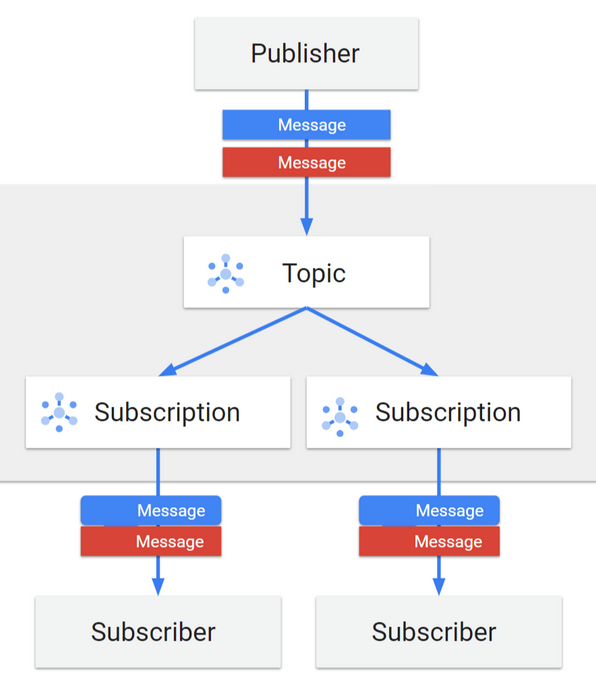

# PubSub Go

This project is an in-memory Pub/Sub (Publish/Subscribe) message broker implemented in Go (Golang). The broker supports a fan-out model for topic-based message delivery. Communication with the message broker is facilitated through a REST API, making it accessible and easy to integrate with other services. Messages are enqueued independently for each subscriber. Publishing uses all-or-nothing delivery: a publish request succeeds only when the topic exists, has at least one subscription, and every subscriber queue can accept the message. If any subscriber queue is full, the publish request fails and the message is not enqueued for any subscriber.

By default, each subscription has a queue capacity of `10` messages. When running the HTTP server, you can override this with the `-queue-size` flag, for example `go run main.go -queue-size 100`. Code that embeds the service directly can override it by constructing the broker with `services.NewPubSub(customCapacity)`.



## Getting Started
### Prerequisites
Go version 1.23.1 or higher.

### Usage
1. Clone the repository: ```git clone https://github.com/rsc1102/PubSub-Go.git```
2. Install dependencies: ```go mod tidy```
3. Run the application: ```go run main.go```
   - Optional: set a custom per-subscription queue capacity with `-queue-size`, for example ```go run main.go -queue-size 100```

### Benchmarks
Run the service-layer benchmarks with:

```bash
go test ./internal/services -run '^$' -bench .
```

The benchmark suite covers:
- `BenchmarkPublish`: publish cost as subscriber fan-out grows.
- `BenchmarkConsume`: steady-state cost of consuming from a subscription.
- `BenchmarkPublishParallel`: concurrent publish throughput against the shared broker state.
- `BenchmarkPublishConsumeParallel`: concurrent publish and consume throughput across sharded topics.

Run the HTTP handler benchmarks with:

```bash
go test ./api/handlers -run '^$' -bench .
```

These benchmarks measure in-process API execution time through the Gin router, including request binding, handler execution, and broker calls for:
- `BenchmarkCreateTopicEndpoint`
- `BenchmarkCreateSubscriptionEndpoint`
- `BenchmarkPublishEndpoint`
- `BenchmarkConsumeEndpoint`

Run the end-to-end HTTP benchmarks with `k6` against a running server:

```bash
go run main.go
```

In another terminal:

```bash
k6 run loadtest/e2e.js
```

Optional environment variables let you tune the target and scenario sizes:

```bash
BASE_URL=http://localhost:8080 \
CREATE_TOPIC_VUS=2 \
CREATE_SUBSCRIPTION_VUS=2 \
PUBLISH_CONSUME_VUS=10 \
k6 run loadtest/e2e.js
```

The `k6` script includes these scenarios:
- `create_topics`: measures end-to-end topic creation throughput.
- `create_subscriptions`: measures topic creation plus subscription creation throughput.
- `publish_consume`: measures publish and consume round-trips using one dedicated topic/subscription per VU.

## API Endpoints
The message broker provides the following REST API endpoints:

1. `GET /ping` : Returns `{ "message": "pong" }` if server is active.
2. `POST /topics`: Creates a topic. 
   - JSON schema: ``` { "topic" : "topic1"}```
3. `DELETE /topics`: Deletes a topic
   - JSON schema: ``` { "topic" : "topic1"}```
4. `GET /topics`: Returns all topics 
5. `POST /subscriptions`: Creates a subscription for a topic. 
   - JSON schema: ``` { "topic": "topic1", "subscription": "alpha" }```
6. `DELETE /subscriptions`: Deletes a subscription for a topic.
   - JSON schema: ``` { "topic": "topic1", "subscription": "alpha" }```
7. `GET /subscriptions`: Returns all subscriptions for a topic if it is provided, else returns all subscriptions for all topics. 
8. `POST /publish`: Publishes message to a topic.
   - JSON schema: ```{ "topic": "topic1", "content": "msg" }```
   - Behavior: message delivery is all-or-nothing across subscriptions for the topic. Publishing fails if the topic does not exist, if the topic has no subscriptions, or if any subscription queue is full. In all failure cases, no subscription receives the message.
9. `POST /consume`: Consumes a message from a subscription.
    - JSON schema: ```{ "topic": "topic1", "subscription": "alpha" }```
   
## Project Structure

```
.
├── go.mod                 # Module definition file
├── go.sum                 # Dependency checksum file
├── main.go                # Entry point of the application
├── README.md              # Project documentation
├── api/handlers/          # Contains API handler
│   ├── handler.go         # API handler
│   ├── handler_test.go    # HTTP handler tests
│   └── handler_benchmark_test.go # HTTP handler benchmarks
├── internal/services/     # Contains internal service logic
│   ├── service.go         # Service implementation
│   ├── service_test.go    # Service tests
│   └── service_benchmark_test.go # Service benchmarks
└── loadtest/
    └── e2e.js             # k6 end-to-end benchmark script
```
